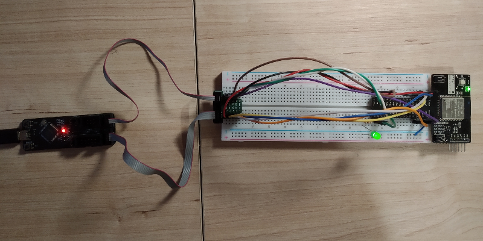
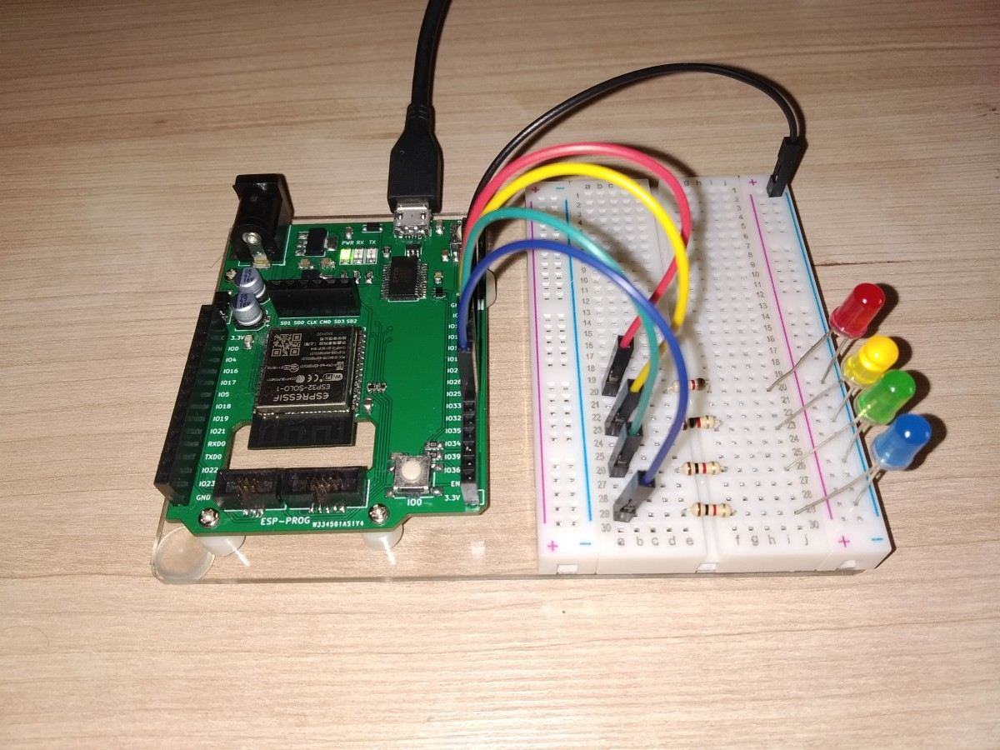

# Various hardware modules

## [esp-prog-adapter](esp-prog-adapter)

Simple adapter allowing to connect [ESP-PROG board](https://docs.espressif.com/projects/espressif-esp-iot-solution/en/latest/hw-reference/ESP-Prog_guide.html)
to breadboard, using provided IDC cables (1.27mm pitch).

## [ESP-32 board on Arduino footprint](modules/esp-32-board)

ESP-WROOM-32 (or ESP32-SOLO-1) development kit with Micro-USB port, DC Input and ESP-PROG interface,
based on Arduino footprint.

