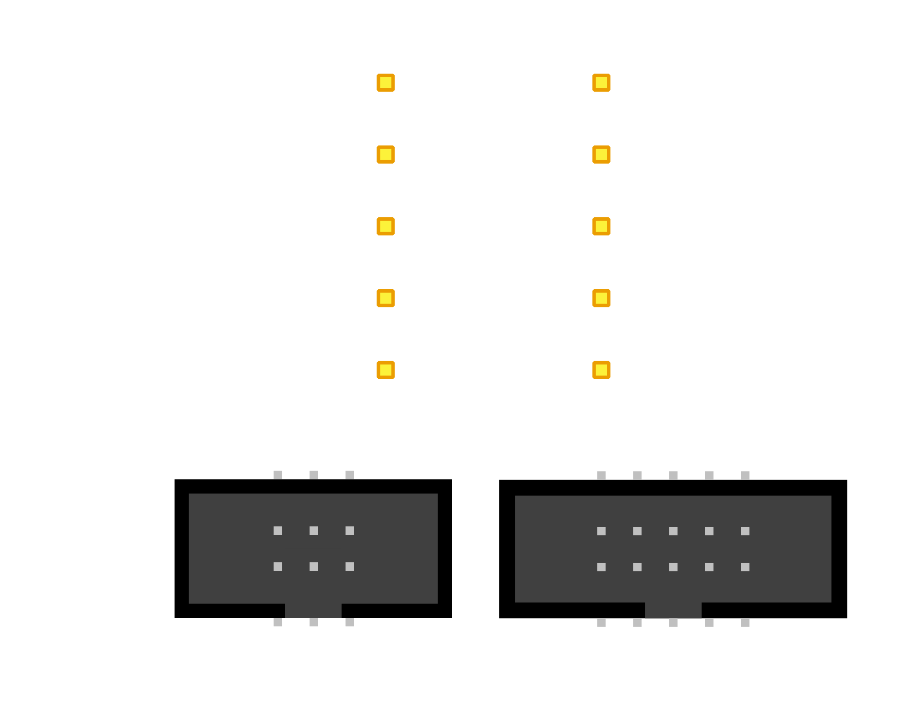
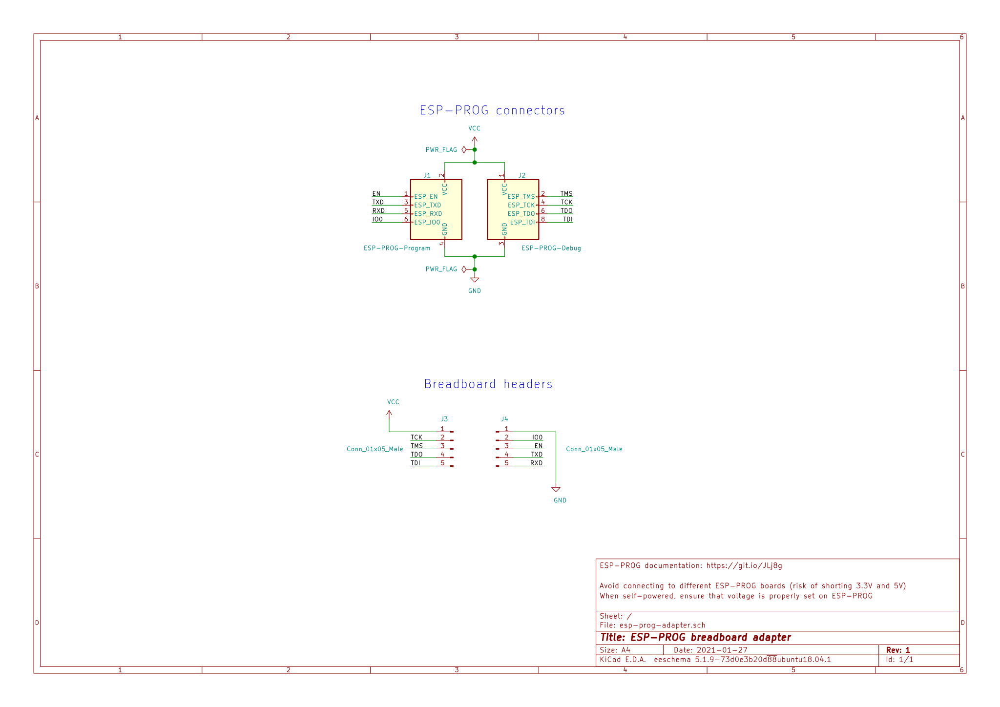
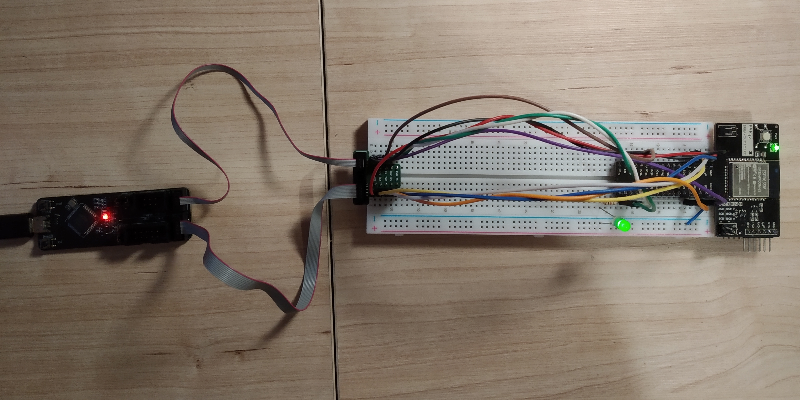
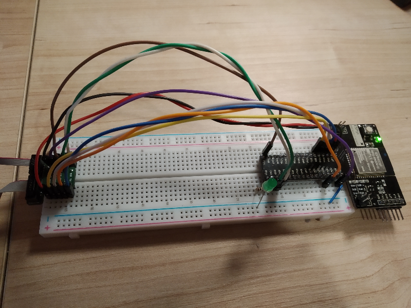

# ESP-PROG breadboard adapter

Simple adapter allowing to connect [ESP-PROG board](https://github.com/espressif/esp-iot-solution/blob/master/documents/evaluation_boards/ESP-Prog_guide_en.md)
to breadboard, using provided IDC cables (1.27mm pitch).

## Schematic

## Pictures

## Wiring guide for popular chips

### ESP32-WROOM-32 (ESP-32)

 Adapter pin | ESP-32 pin | No  
:-----------:|:----------:|:---:
|   RXD      |    RXD0    | 34   
|   TXD      |    TXD0    | 35
|   EN       |    EN      | 3
|   IO0      |    IO0     | 25
|   TDI      |    IO12    | 14
|   TDO      |    IO15    | 23
|   TMS      |    IO14    | 13
|   TCK      |    IO13    | 16
|   VCC      |    3V3     | 2
|   GND      |    GND     | 1, 15, 38
 

Datasheet: https://www.espressif.com/sites/default/files/documentation/esp32-wroom-32_datasheet_en.pdf

### ESP32-S2-WROOM (ESP-32-S2)
 Adapter pin | ESP-32 pin | No  
:-----------:|:----------:|:---:
|   RXD      |    RXD0    | 38
|   TXD      |    TXD0    | 37
|   EN       |    EN      | 41
|   IO0      |    IO0     | 3
|   TDI      |    IO41    | 35
|   TDO      |    IO40    | 34
|   TMS      |    IO42    | 36
|   TCK      |    IO39    | 33
|   VCC      |    3V3     | 2
|   GND      |    GND     | 1, 26, 42

Datasheet: https://www.espressif.com/sites/default/files/documentation/esp32-s2-wroom_esp32-s2-wroom-i_datasheet_en.pdf

### ESP-WROOM-02 (ESP8266)
 Adapter pin | ESP-32 pin | No  
:-----------:|:----------:|:---:
|   RXD      |    RXD     | 11
|   TXD      |    TXD     | 12
|   EN       |    EN      | 2
|   IO0      |    IO0     | 8
|   TDI      |    N/A [1] | N/A [1]
|   TDO      |    N/A [1] | N/A [1]
|   TMS      |    N/A [1] | N/A [1]
|   TCK      |    N/A [1] | N/A [1]
|   VCC      |    3V3     | 1
|   GND      |    GND     | 9, 13, 18

[1] JTAG online debugging is supported only on ESP-32 platform

Datasheet: https://www.espressif.com/sites/default/files/documentation/0c-esp-wroom-02_datasheet_en.pdf

### Resources
- [Project on PCBWay](https://www.pcbway.com/project/shareproject/ESP_Prog_breadboard_adapter.html)
- [Gerbers](https://github.com/rafw87/esp-prog-adapter/blob/master/docs/esp-prog-adapter-pcbway.zip?raw=true)

# License
 This work is licensed under a <a rel="license" href="http://creativecommons.org/licenses/by-sa/4.0/">Creative Commons Attribution-ShareAlike 4.0 International License</a>.
