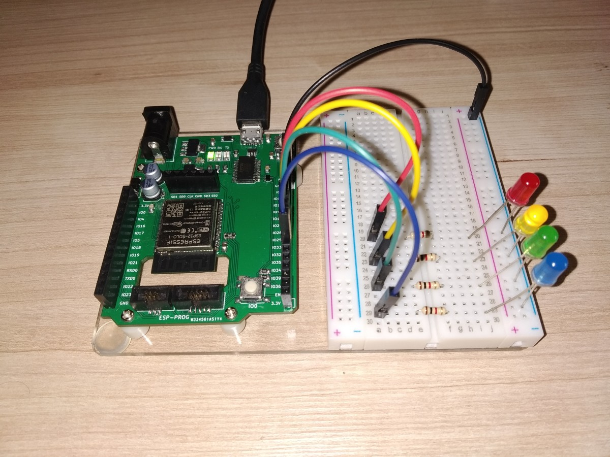
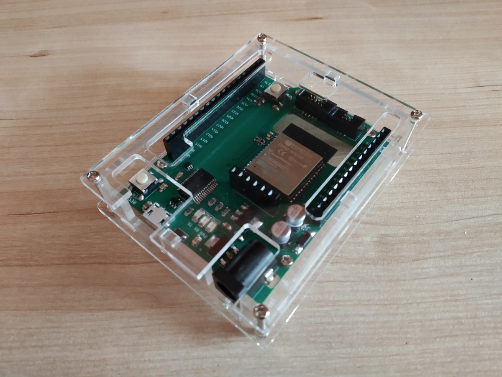
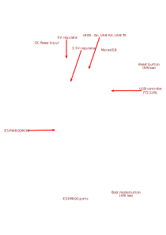

# ESP-32 board on Arduino footprint

ESP-WROOM-32 (or ESP32-SOLO-1) development kit with Micro-USB port, DC Input and ESP-PROG interface.

Based on Arduino Uno/Leonardo footprint, so (apart from interesting appearance)
allows to use stands and (partially) enclosures from original Arduino.

**Note:** It's not an Arduino clone, so it's not compatible (neither electrically nor physically) with Arduino shields.
Functionally it's evaluation board like ESP32-DevKitC.

## Resources
- [Schematic](docs/esp-32-board-schematic.pdf?raw=true)
- [BOM](https://htmlpreview.github.io/?https://raw.githubusercontent.com/rafw87/hardware-modules/master/modules/esp-32-board/docs/esp-32-board-bom.html)
- Gerbers
  - [PCBWay](docs/gerbers/esp-32-board-PCBWay.zip?raw=true)

## License
 This work is licensed under a <a rel="license" href="http://creativecommons.org/licenses/by-sa/4.0/">Creative Commons Attribution-ShareAlike 4.0 International License</a>.
