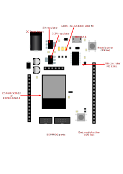

# ESP-32 board on Arduino footprint

ESP-32 development kit with Micro-USB port, DC Input and ESP-PROG interface.

Based on Arduino Uno/Leonardo footprint, so (apart from interesting appearance)
allows to use stands and (partially) enclosures from original Arduino.

### Resources
- [Schematic](docs/esp-32-board-schematic.pdf?raw=true)
- Gerbers
  - [PCBWay](docs/gerbers/esp-32-board-PCBWay.zip?raw=true)

# License
 This work is licensed under a <a rel="license" href="http://creativecommons.org/licenses/by-sa/4.0/">Creative Commons Attribution-ShareAlike 4.0 International License</a>.
