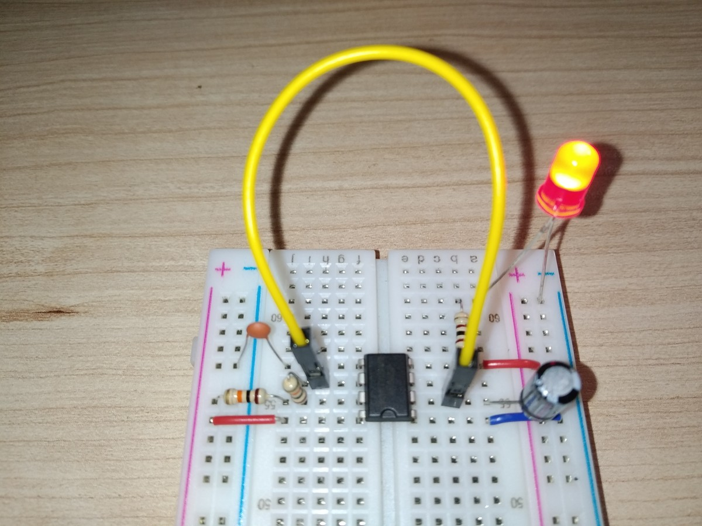
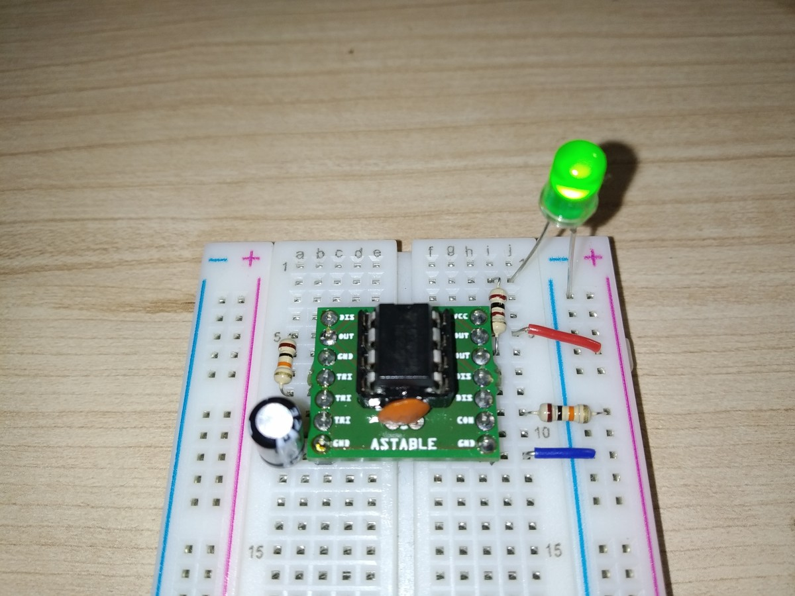
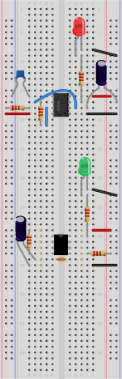
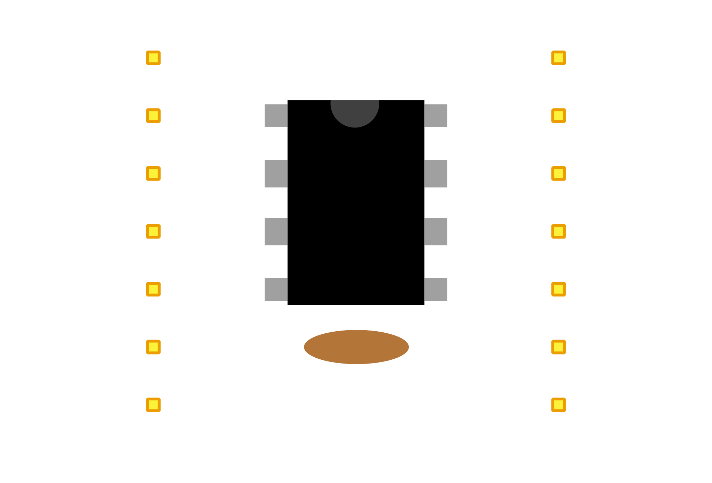

# NE555 Astable Circuit Breadboard Adapter

## Story
OK, so you want to build a timer, emiting pulses with given interval on breadboard using NE555. Easy, right?
All you need is to put your NE555 in the middle and implement astable circuit around it, like this:

Looks easy? Only on the schematic :wink:
- Trigger and Treshold should be connected, but are on the opposite side, so single jumper is not an option.
  What is the shortest wire you have? :)
- R2 should connect pin 7 either with pin 2 (over IC?) or with pin 6 (requires vertical resistor).
- You need power and ground on both sides.
- Quickly you have no idea which pins are connected without looking into schematic :wink:

Finally you ends with something like this:

Maybe is there any easier way? :thinking: Maybe some adapter?

## Adapter

This adapter implements common wiring for NE555 astable circuit, exposing pins for external R1, R2 and C1,
and of course for VCC, GND and output. Additionally exposes pin for Control, but allows also to solder fixed C2 capacitor.
Some pins are duplicated, making it easier to connect and allowing to choose most comfortable pitch.

Comparison:

- Trigger and Treshold are internally connected and exposed as TRI
- Distance between R2 terminals can be 7.62mm, 10.16mm or 12.7mm (3, 4 or 5 holes on breadboard) making it easy to connect
  with horizontal resistor
- It's possible to connect to VCC/GND only from one side (as above)
- Pins are labelled

Adapter from top:

## Resources
- [Schematic](docs/ne555-astable-adapter-schematic.pdf?raw=true)
- [BOM](https://htmlpreview.github.io/?https://raw.githubusercontent.com/rafw87/hardware-modules/master/modules/ne555-astable-adapter/docs/ne555-astable-adapter-bom.html)
- Gerbers
  - [PCBWay](docs/gerbers/ne555-astable-adapter-PCBWay.zip?raw=true)

## License
 This work is licensed under a <a rel="license" href="http://creativecommons.org/licenses/by-sa/4.0/">Creative Commons Attribution-ShareAlike 4.0 International License</a>.
